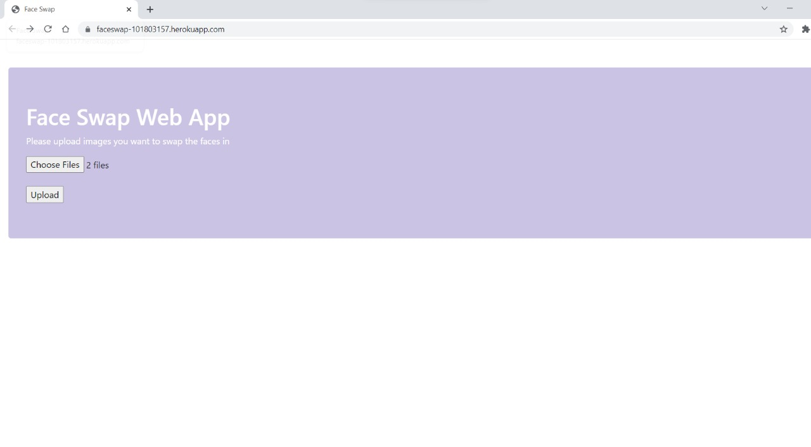
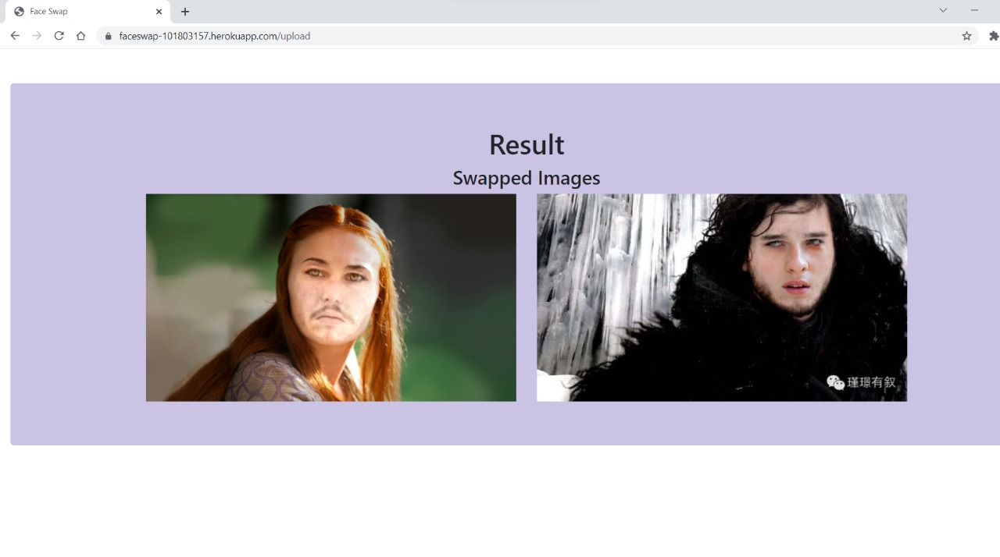
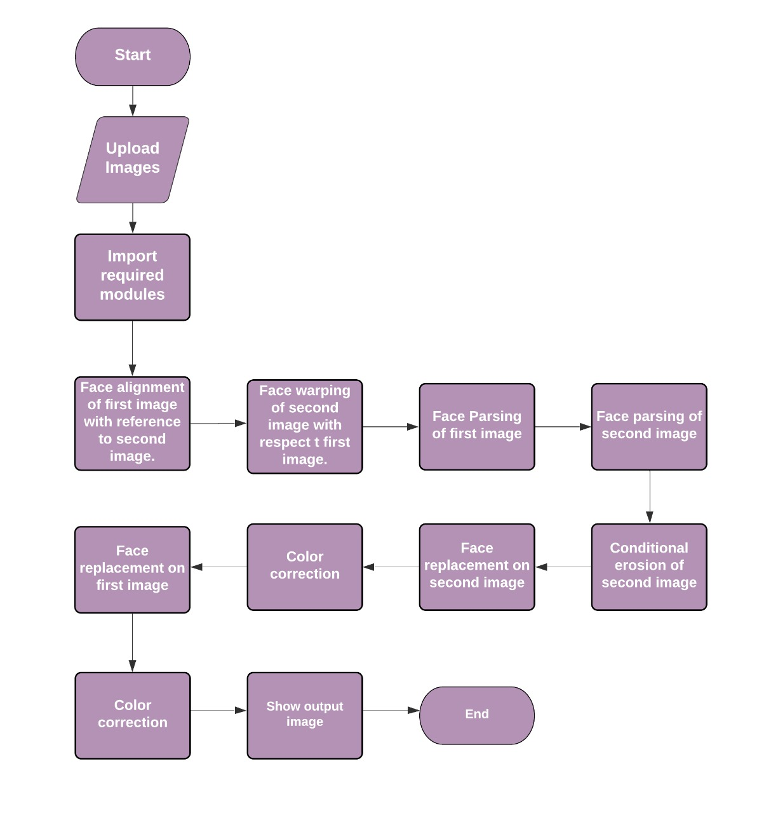

# UCS757:Building Innovative Systems

# Project 2: Face Swap
## Introduction
This project swaps the faces in 2 different images.

## Requirements
1. Python
2. Scipy
3. Dlib
4. OpenCV-Python

## Live Link
https://faceswap-101803157.herokuapp.com/

## Input Interface

## Input
  

## Output   

## Flowchart

## Limitation
This technique requires the images to be clear and the faces facing frontwards for accurate results.

## Submitted by:-
### Srishti Mittal
### 101803157
### COE 8